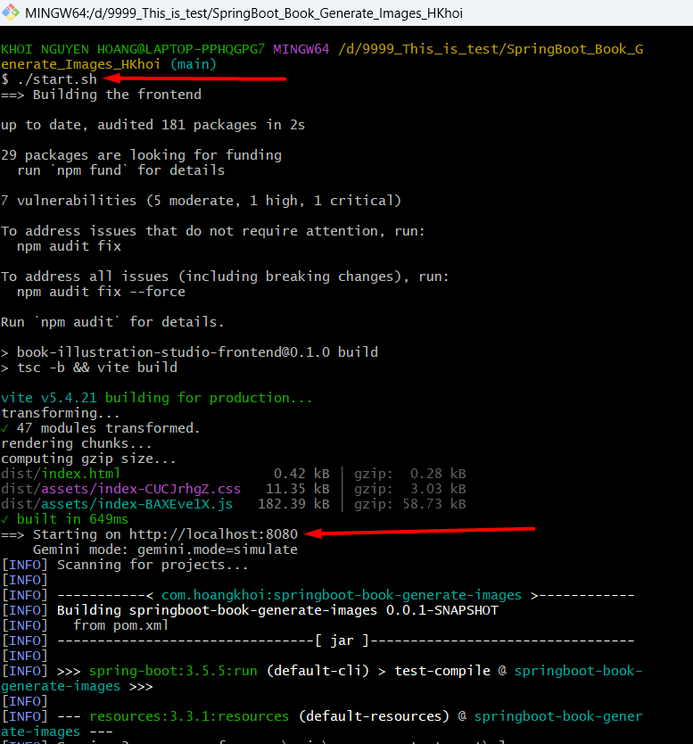
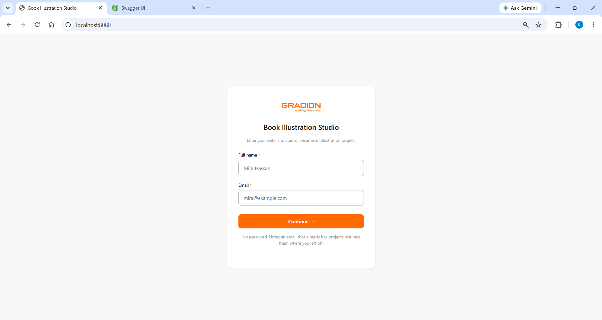
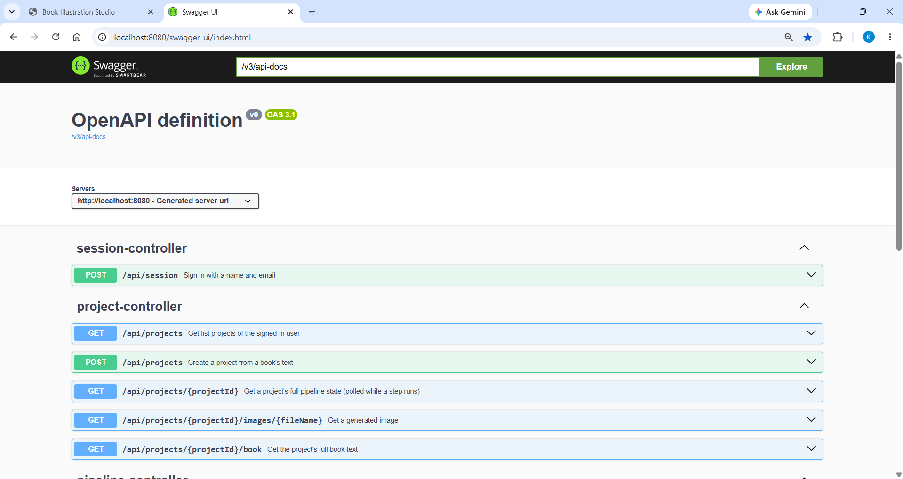

# Book Illustration Studio

Turns a book's text into character portraits and a chapter illustration using the Gemini API,
following the five steps of Google's
[Book illustration cookbook notebook](https://colab.research.google.com/github/google-gemini/cookbook/blob/main/examples/Book_illustration.ipynb):
**style → characters → portraits → chapters → illustrations**, each run by an explicit user action.

Spring Boot 3.5 / Java 21 backend, React + Vite frontend, JSON files and images on the local disk.
No database, no cloud storage.

## Prerequisites

- **Java 21** (`java -version`)
- **Node 18+** (`node -v`) — for the frontend
- A **Gemini API key** — only for real generation; the app runs fully without one (see below)

## Start

```bash
./start.sh          
```

On first run it creates `src/main/resources/application.properties` from the committed example —
that file is gitignored, so a fresh clone has none and no key is ever committed. Then it builds the
frontend, copies it into the backend's static resources, and starts one process on
**http://localhost:8080**. One origin, so there is no CORS to configure.


Swagger UI is at http://localhost:8080/swagger-ui.html.


Example:





## Test

```bash
./test.sh           
```

Runs both suites and writes `test-report.txt`. Needs no API key — Gemini is faked throughout. See
[TESTING.md](TESTING.md).


## Running without an API key

The Gemini layer has two implementations behind one interface, chosen by a single property in
`src/main/resources/application.properties`:

```properties
gemini.mode=simulate     # or: real
```

| | |
|---|---|
| `real` | Calls the Gemini API. Needs `GEMINI_API_KEY`. The default if the property is missing. |
| `simulate` | No key, no quota. Generated placeholder text and drawn PNGs, with realistic delays so running / retry / concurrency behave like the real thing. |

Simulated delays are tunable — raise them to make in-progress states easy to catch by hand:

```properties
gemini.simulate.text-delay=3s
gemini.simulate.image-delay=15s
```

## Environment variables

Copy [application.example.properties](src/main/resources/application.example.properties) and fill it in. Nothing else is required.

To use real Gemini, put your key in `src/main/resources/application.properties` (created on first
`./start.sh`) and set the mode:

```properties
gemini.mode=real
gemini.api-key=YOUR_KEY_HERE
```

## Architecture

```
controller/   HTTP routes; every JSON response is ApiResponse<T>
dto/          request/ and response/ payloads
service/      PipelineService (orchestration), PipelineRules (the ordering rules),
              GeminiClient (interface)  ·  service/impl: Rest + Simulate clients
repository/   ProjectRepository, JsonStore (atomic writes), ProjectLocks
model/        Project, User, IllustratedItem
enums/        Step, ProjectStatus, StepState, ItemState, RunRejection
exception/    exceptions + handler/GlobalExceptionHandler
config/       GeminiProperties, PipelineConfig (the executor)
frontend/     React + Vite + TypeScript, tested with Vitest
```

**Storage** is a JSON document store on disk. One directory per project, so isolation between users
is structural rather than enforced in code:

```
data/users/{userId}/user.json
                   /projects/{projectId}/project.json   ← pipeline state
                                        /book.txt       ← the book, kept out of the polled payload
                                        /images/*.png
```

Every write goes to a temp file and is renamed into place, so a reader sees the old document or the
new one, never half of one. Every read *and* write happens under a per-project lock.

## API

| Method | Path | |
|---|---|---|
| POST | `/api/session` | Sign in with name + email; creates the user if unknown |
| GET | `/api/projects` | The caller's projects (no book text) |
| POST | `/api/projects` | Create from a title + book text |
| GET | `/api/projects/{id}` | Full pipeline state — the polled endpoint |
| GET | `/api/projects/{id}/book` | The book text |
| POST | `/api/projects/{id}/steps/{step}/run` | Start a step; optional `{"style": "..."}` on step 1 |
| POST | `/api/projects/{id}/steps/{step}/reset` | Release a step stranded by a restart |
| GET | `/api/projects/{id}/images/{file}` | Image bytes |

Identity is an `X-User-Id` header — no password, no OAuth, by design. Every JSON response is
`{success, message, data}`; failures put `{code, currentStep}` in `data` so the UI can branch on
the code. Refused runs are `409` with `ALREADY_RUNNING`, `OUT_OF_ORDER` or `PIPELINE_COMPLETE`.

