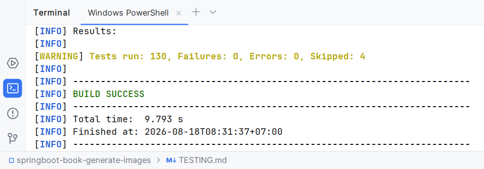
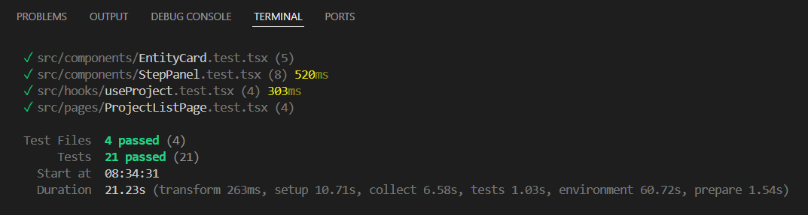

# Testing

```bash
./test.sh          # both suites, writes test-report.txt   (Windows: test.cmd)
```

No API key needed: Gemini is faked in every test. The suite never spends quota.

## What I test, and why those things

The pipeline's value is in its **rules**, not its plumbing, so that's where the tests are
concentrated: what may run, what may not, what survives a failure, and what a second tab gets.

**Backend — the state machine (`PipelineRulesTest`, 18 tests).** Pure logic, no Spring, no disk.
`now` is a parameter everywhere, so staleness is tested without sleeping. These pin the ordering
rule from both sides: finishing step N makes exactly step N+1 current, a completed step is refused,
a step whose predecessors haven't run is refused, and a stale step is *still* refused rather than
implicitly runnable.

**Backend — storage (`JsonStoreTest`, `ProjectLocksTest`, `ProjectRepositoryTest`, 23 tests).**
Choosing files over a database means concurrency is my problem, so it gets real tests rather than
assumptions: eight threads appending to one project all land with no lost update; 100 writes racing
100 reads corrupt nothing; user B cannot load user A's project by id; `project.json` provably does
not contain the book text. `readingWhileWritingBreaksNeither` exists because that case actually
broke — see `DECISIONS.md`, override 3.

**Backend — the pipeline service (`PipelineServiceTest`, 18 tests).** The requirements from §4.3,
one test each. The one that matters most holds a fake Gemini call open on a latch so a second
request arrives while the first is genuinely in flight, then asserts both the `ALREADY_RUNNING`
rejection *and* that the image count stayed at 2 rather than 4. Others: the book reaches Gemini
exactly once across all five steps; retrying portraits redraws only the one that failed; a chatty
model returning five characters costs two images, not five; a restart releases stranded steps.

**Backend — HTTP (`*ControllerTest`, 27 tests, Mockito).** Routing, validation, status codes and
payload shape, with storage mocked. Two use `verify(repository, never())` to prove a rejected
request never reaches storage — a test that only checked the 400 would pass even if the project had
already been written.

**Backend — the Gemini client (`RestGeminiClientTest`, 19 tests).** `MockRestServiceServer`, no
network. Asserts what goes on the wire (book uploaded once then referenced by URI; every later call
carries `previous_interaction_id`) and that replies are read robustly.

**Frontend — component states (21 tests).** `StepPanel` in all five states — ready, running,
failed, stranded, finished — because that component is where every §4.3 behaviour becomes visible.
`EntityCard` for per-item image progress. `ProjectListPage` for the empty state and status pills.
`useProject` for the client half of the duplicate guard: a 409 `ALREADY_RUNNING` must *not* surface
as an error, it must trigger a re-read.

**End to end (`PipelineIntegrationTest`, 6 tests).** The real application context, real controllers,
real service, real files on disk, real background executor — only Gemini faked. Signs in, creates a
project, runs all five steps while polling the same endpoint the browser polls, fetches every
generated image back through the API, and confirms the files survive on disk.

## What I deliberately don't test

**No E2E browser tests.** The brief says they aren't expected. The integration test already covers
the wiring end to end; Playwright would add a browser and minutes of runtime to catch little the
component tests and manual UAT don't.

**No tests against the live Gemini API in the normal suite.** `LiveGeminiVerificationTest` exists
and hits the real API, but it's skipped unless `GEMINI_API_KEY` is set — the 4 skips in the report
below. Running it in CI would spend quota on every push and fail whenever Google has a bad minute.
It's a tool for confirming the wire format on demand, not a regression test:

```bash
GEMINI_API_KEY=... ./mvnw test -Dtest=LiveGeminiVerificationTest
```

**No tests for getters, DTO mapping, or Spring's own behaviour.** If a test would only fail when
Jackson or Spring MVC is broken, it isn't earning its place.

**No frontend tests for routing or the sign-in form.** Both are thin, both are covered by the manual
pass, and neither encodes a rule that could silently drift. I'd rather have twenty tests I'd notice
failing than sixty I'd skim.

**No load or performance tests.** Single user, single process, by design.

## Manual checks the automated tests can't make

Run with `gemini.mode=simulate` and `gemini.simulate.image-delay=15s`, which makes the slow states
long enough to interact with:

1. Start Portraits, open the project in a second tab, click Generate again → 409, and the UI shows
   the running state rather than an error.
2. Refresh mid-step → the step keeps running server-side and the page reconnects to it.
3. Kill the backend mid-step, restart → the project reopens as failed with "interrupted by a server
   restart", and retrying redraws only the portrait that never landed.
4. Watch `data/users/*/projects/*/project.json` flip `IDLE → RUNNING → IDLE` during a step.
5. Finish all five steps: the chapter illustration has the portraits painted along its bottom edge,
   which is the simulator making the conversation chaining visible.

## Test report

Real output. Regenerate with `./test.sh` (or `test.cmd`), which also writes `test-report.txt`.

### Backend — `./mvnw test`

```
Tests run: 18, Failures: 0, Errors: 0, Skipped: 0 -- in service.PipelineServiceTest
Tests run: 15, Failures: 0, Errors: 0, Skipped: 0 -- in repository.ProjectRepositoryTest
Tests run: 14, Failures: 0, Errors: 0, Skipped: 0 -- in controller.ProjectControllerTest
Tests run: 10, Failures: 0, Errors: 0, Skipped: 0 -- in controller.PipelineControllerTest
Tests run: 18, Failures: 0, Errors: 0, Skipped: 0 -- in service.PipelineRulesTest (4 nested)
Tests run: 19, Failures: 0, Errors: 0, Skipped: 0 -- in service.impl.RestGeminiClientTest (4 nested)
Tests run:  8, Failures: 0, Errors: 0, Skipped: 0 -- in model.ProjectStateTest
Tests run:  6, Failures: 0, Errors: 0, Skipped: 0 -- in PipelineIntegrationTest
Tests run:  5, Failures: 0, Errors: 0, Skipped: 0 -- in controller.SessionControllerTest
Tests run:  5, Failures: 0, Errors: 0, Skipped: 0 -- in repository.JsonStoreTest
Tests run:  5, Failures: 0, Errors: 0, Skipped: 0 -- in service.impl.GeminiModeTest (2 nested)
Tests run:  3, Failures: 0, Errors: 0, Skipped: 0 -- in repository.ProjectLocksTest
Tests run:  4, Failures: 0, Errors: 0, Skipped: 4 -- in service.impl.LiveGeminiVerificationTest
Tests run:  1, Failures: 0, Errors: 0, Skipped: 0 -- in SpringbootBookGenerateImagesApplicationTests

Results:

Tests run: 130, Failures: 0, Errors: 0, Skipped: 4

BUILD SUCCESS
```

The 4 skips are `LiveGeminiVerificationTest`, which runs only when `GEMINI_API_KEY` is set.

Following is the image of evidence:


### Frontend — `npm test`

```
 RUN  v2.1.9

 ✓ src/components/EntityCard.test.tsx (5 tests)
 ✓ src/pages/ProjectListPage.test.tsx (4 tests)
 ✓ src/hooks/useProject.test.tsx (4 tests)
 ✓ src/components/StepPanel.test.tsx (8 tests)

 Test Files  4 passed (4)
      Tests  21 passed (21)
   Duration  2.65s
```

Following is the image of evidence:



Both suites run from the single `./test.sh`, which exited `backend exit=0  frontend exit=0` and
wrote the full output to `test-report.txt`.